<div align="center">


[](https://git.io/typing-svg)

[](https://github.com/zaydzaari)
[](https://github.com/zaydzaari?tab=followers)

</div>

## `> whoami`

```yaml
name: Zayd Zaari
location: Morocco
focus:
  - mobile products
  - web applications
  - AI agents
currently_building: Congress Trade Tracker
next_goal: Build an agent with tools, memory, safety, and real evaluations
```

I care about the part between an idea and a finished product: shaping the experience, building it, fixing what breaks, and shipping something real.

## `> current_work`

> **Congress Trade Tracker** — a premium Expo application for public congressional disclosure tracking, paid alerts, and simulated portfolios.

> **AI Agents** — learning tool calling, context management, memory, guardrails, evaluation, and cost-aware architecture.

## `> toolkit`

<div align="center">

[](https://skillicons.dev)

</div>

## `> selected_projects`

<div align="center">

<a href="https://github.com/zaydzaari/studymaster-ai">
  
</a>
<a href="https://github.com/zaydzaari/RemoteCraft">
  
</a>

**[Launch StudyMaster AI ↗](https://studymaster-ai-two.vercel.app)**

</div>

## `> github_activity`

<div align="center">







</div>

## `> contributions`

<picture>
  <source media="(prefers-color-scheme: dark)" srcset="https://raw.githubusercontent.com/zaydzaari/zaydzaari/output/github-snake-dark.svg" />
  <source media="(prefers-color-scheme: light)" srcset="https://raw.githubusercontent.com/zaydzaari/zaydzaari/output/github-snake.svg" />
  
</picture>

## `> connect`

I’m open to **open-source collaboration, mentorship, hackathons, internships, and ambitious projects**.

If you are building something thoughtful and need a motivated contributor, reach me through GitHub.

<div align="center">


</div>
