<!--
  ZZ // CONTROL PLANE
  Every image below is rendered by scripts/generate_profile.py.
  Numbers come from the public GitHub API, refreshed weekly by .github/workflows/update-profile.yml.
  Edit the script, not the SVGs.
-->

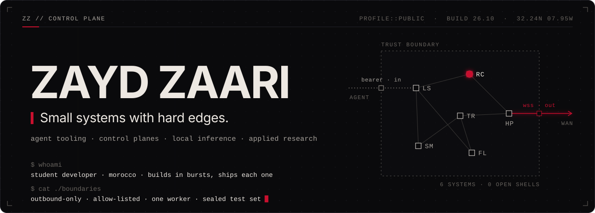

<code>00 / HANDSHAKE</code>

Student developer in Morocco. Most of what I build sits between something powerful and something that shouldn't get full access to it: an AI agent and a video, Google Home and a Windows PC, a web dashboard and a Linux server.

I keep those systems narrow on purpose. A fixed list of actions, one worker, one SSH boundary. I try to keep my claims the same size: the headline result of my forest-loss study is that it found no clear effect.

 

<code>01 / PLANES</code>&nbsp; three control planes, each with the things it refuses to do

<a href="https://github.com/zaydzaari/linkscribe">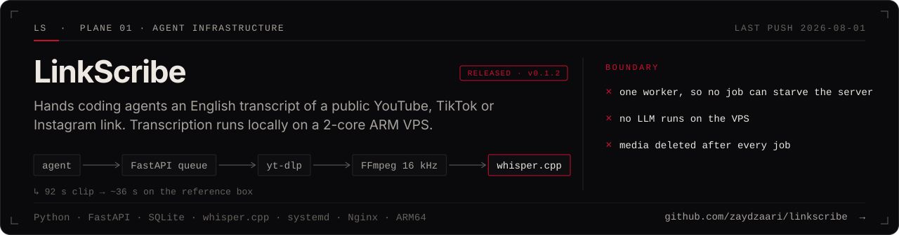</a>
&nbsp;&nbsp;<a href="https://github.com/zaydzaari/linkscribe">repo</a> · <a href="https://51-170-131-7.sslip.io/">live service</a> · <a href="https://github.com/zaydzaari/linkscribe/releases/tag/v0.1.2">release v0.1.2</a>

<a href="https://github.com/zaydzaari/HomePC">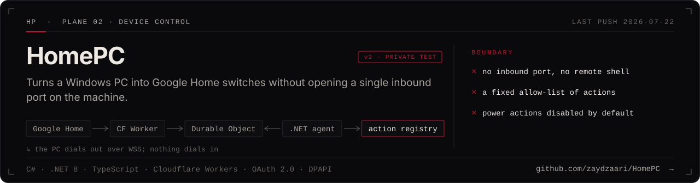</a>
&nbsp;&nbsp;<a href="https://github.com/zaydzaari/HomePC">repo</a> · <a href="https://github.com/zaydzaari/HomePC/releases">releases</a>

<a href="https://github.com/zaydzaari/RemoteCraft">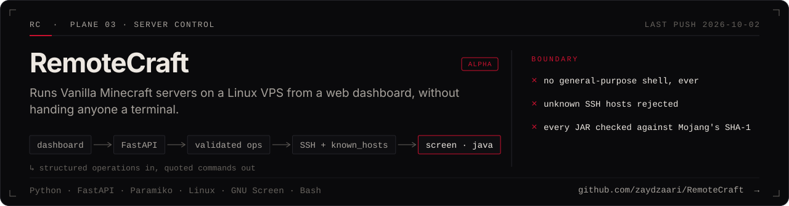</a>
&nbsp;&nbsp;<a href="https://github.com/zaydzaari/RemoteCraft">repo</a>

 

<code>02 / FIELD STUDY</code>&nbsp; 642 models trained to answer one narrow question

<a href="https://github.com/zaydzaari/geographic-training-diversity-forest-loss">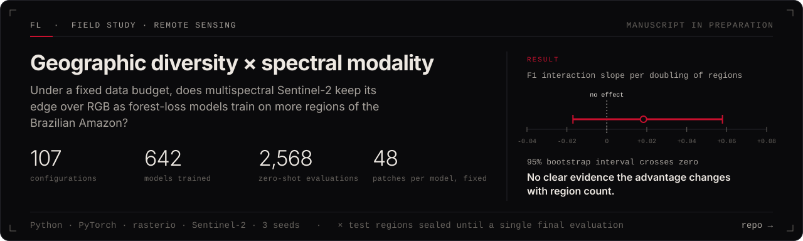</a>
&nbsp;&nbsp;<a href="https://github.com/zaydzaari/geographic-training-diversity-forest-loss">code, configs and frozen results</a> · <a href="https://orcid.org/0009-0007-5967-1692">ORCID</a>

 

<code>03 / BENCH</code>&nbsp; one shipped product, one lab run

<a href="https://github.com/zaydzaari/studymaster-ai">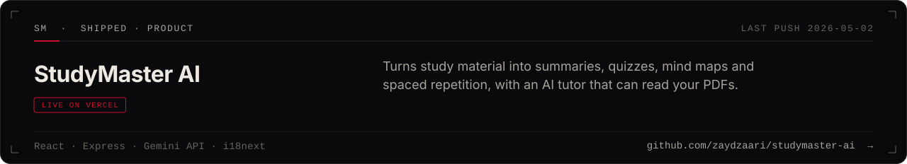</a>
&nbsp;&nbsp;<a href="https://github.com/zaydzaari/studymaster-ai">repo</a> · <a href="https://studymaster-ai-two.vercel.app">open the app</a>

<a href="https://github.com/zaydzaari/trident-fps">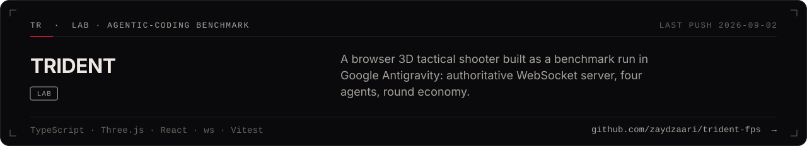</a>
&nbsp;&nbsp;<a href="https://github.com/zaydzaari/trident-fps">repo</a>

 

<code>04 / TOPOLOGY</code>&nbsp; how the projects relate, and what they share

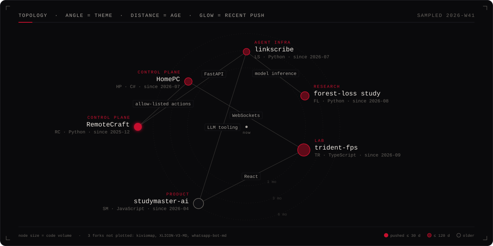

 

<code>05 / TOOLCHAIN</code>&nbsp; grouped by what it's for; every row traces back to a repo

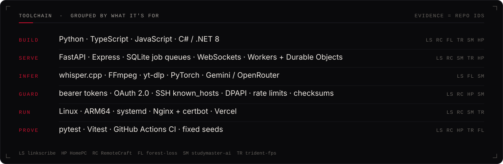

 

<code>06 / TELEMETRY</code>&nbsp; measured, not claimed

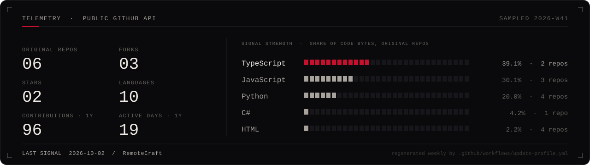

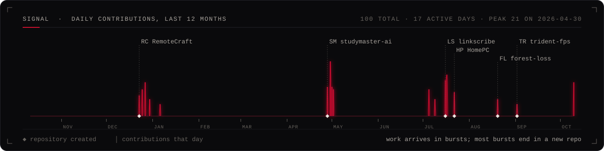

 

<code>07 / EGRESS</code>

Open to collaborating on agent tooling, self-hosted infrastructure and applied ML research. The fastest route is an issue or discussion on any of the repos above.

<a href="https://github.com/zaydzaari">github.com/zaydzaari</a> · <a href="https://orcid.org/0009-0007-5967-1692">orcid.org/0009-0007-5967-1692</a> · <a href="https://studymaster-ai-two.vercel.app">studymaster-ai-two.vercel.app</a>

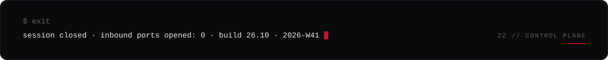
